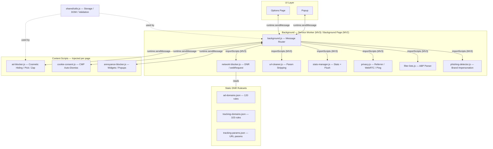

<p align="center">
  
</p>

<h1 align="center">WebSuddhi</h1>

<p align="center">
  <strong>Block ads. Strip trackers. Dismiss cookies. Remove paywalls. Reclaim your web.</strong>
</p>

<p align="center">
  <em>"Suddhi" (शुद्धि) — Sanskrit for purification</em>
</p>

<p align="center">
  <a href="#installation"></a>
  <a href="#supported-browsers"></a>
  <a href="#supported-browsers"></a>
  <a href="#supported-browsers"></a>
  <a href="#supported-browsers"></a>
  <a href="LICENSE"></a>
</p>

<p align="center">
  <a href="#installation">Install</a> &bull;
  <a href="#features">Features</a> &bull;
  <a href="#how-it-works">How It Works</a> &bull;
  <a href="#developer-guide">Contribute</a> &bull;
  <a href="#comparison">Compare</a>
</p>

---

## The Problem

Every website today bombards you with:

- **Ads** that slow pages, drain battery, and track you across the web
- **Cookie banners** on every single site, begging you to "Accept All"
- **Paywalls** locking information behind subscription gates
- **Chat widgets, newsletter popups, push prompts** cluttering every corner
- **Tracking parameters** in URLs (utm_source, fbclid, gclid) following you everywhere

WebSuddhi solves all of this. One extension. Zero data collection. Every browser.

---

## Features

### Core Protection

| | Feature | What It Does |
|---|---------|-------------|
| **1** | **Network Blocking** | Blocks ad & tracking requests *before they load* — saves bandwidth, speeds up pages |
| **2** | **Cosmetic Blocking** | Hides ad elements from 50+ networks using 200+ CSS selectors |
| **3** | **URL Cleaning** | Strips 60+ tracking parameters from URLs (utm, fbclid, gclid, msclkid, etc.) |
| **4** | **Cookie Auto-Dismiss** | Automatically clicks "Reject All" on cookie banners from 9+ CMP frameworks |
| **5** | **Paywall Removal** | Removes paywalls, subscribe overlays, and article gates |
| **6** | **Annoyance Blocker** | Hides chat widgets, newsletter popups, push notification prompts, app install banners |

### Privacy & Control

| | Feature | What It Does |
|---|---------|-------------|
| **7** | **Referrer Stripping** | Prevents sites from knowing where you came from |
| **8** | **WebRTC Protection** | Prevents IP address leaks through WebRTC |
| **9** | **Ping Prevention** | Blocks hyperlink auditing (`<a ping>`) used for click tracking |
| **10** | **Filter Lists** | Subscribe to custom blocklists with ABP syntax support + auto-updates |

### User Tools

| | Feature | What It Does |
|---|---------|-------------|
| **11** | **Pick Element** | Point-and-click to permanently block any element on any page |
| **12** | **Zap Mode** | Quick-hide any element temporarily (doesn't persist) |
| **13** | **Per-Site Whitelist** | Disable protection for sites you trust |
| **14** | **Statistics Dashboard** | Track blocks over time with per-site breakdown and charts |
| **15** | **Export / Import** | Backup and share your custom rules |
| **16** | **Security Info** | View site certificate details (Firefox) or security status (all browsers) |
| **17** | **Third-Party Frames** | Detect and manage embedded iframes from other domains |

---

## How It Works

```
 Request Lifecycle                Content Lifecycle
 ═══════════════════              ═══════════════════

 Browser makes request            Page DOM loads
        │                                │
        ▼                                ▼
 ┌─────────────────┐             ┌─────────────────┐
 │ Network Blocker  │             │ Cosmetic Blocker │
 │ (223 DNR rules)  │             │ (200+ selectors) │
 │                  │             │                  │
 │ Block ads &      │             │ Hide ad elements │
 │ trackers before  │             │ that weren't     │
 │ they load        │             │ network-blocked  │
 └────────┬─────────┘             └────────┬─────────┘
          │                                │
          ▼                                ▼
 ┌─────────────────┐             ┌─────────────────┐
 │  URL Cleaner     │             │ Cookie Consent   │
 │                  │             │                  │
 │ Strip tracking   │             │ Auto-dismiss     │
 │ params from URLs │             │ cookie banners   │
 └────────┬─────────┘             └────────┬─────────┘
          │                                │
          ▼                                ▼
 ┌─────────────────┐             ┌─────────────────┐
 │ Privacy Layer    │             │ Annoyance Block  │
 │                  │             │                  │
 │ Strip referrers  │             │ Hide chat, popups│
 │ Block pings      │             │ push prompts     │
 │ Protect WebRTC   │             │ app banners      │
 └─────────────────┘             └─────────────────┘
```

**Two layers of defense:**

1. **Network layer** (background) — Blocks requests using Chrome's `declarativeNetRequest` (MV3) or `webRequest` (MV2). Ads never load. Zero bandwidth wasted.
2. **Content layer** (page) — Hides any elements that slip through, dismisses cookie banners, removes paywalls, and cleans up annoyances.

---

## Comparison

How WebSuddhi stacks up against other popular ad blockers:

| Feature | WebSuddhi | uBlock Origin | AdBlock Plus | Ghostery |
|---------|:---------:|:-------------:|:------------:|:--------:|
| Network-level blocking | Yes | Yes | Yes | Yes |
| Cosmetic element hiding | Yes | Yes | Yes | Limited |
| Cookie banner auto-dismiss | Yes | No | No | No |
| Paywall removal | Yes | No | No | No |
| URL tracking param stripping | Yes | No | No | No |
| Annoyance blocking (chat, popups) | Yes | Partial | No | No |
| Referrer stripping | Yes | No | No | Yes |
| WebRTC leak protection | Yes | No | No | No |
| Custom filter list subscriptions | Yes | Yes | Yes | No |
| Safari iOS support | Yes | No | No | Yes |
| Zero dependencies | Yes | No | No | No |
| Data collection | None | None | Acceptable Ads* | Analytics* |

<sub>* AdBlock Plus has "Acceptable Ads" program. Ghostery collects anonymized analytics.</sub>

---

## Supported Browsers

| Browser | Version | Manifest | Status |
|---------|---------|----------|--------|
| Google Chrome | 112+ | MV3 | ✅ Fully supported |
| Microsoft Edge | 112+ | MV3 | ✅ Fully supported |
| Firefox | 109+ | MV2 | ✅ Fully supported |
| Safari macOS | 15+ | MV3 | ✅ Fully supported |
| Safari iOS | 15+ | MV3 | ✅ Fully supported |
| Opera | Latest | MV3 | ✅ Fully supported |
| Brave | Latest | MV3 | ✅ Fully supported |
| Vivaldi | Latest | MV3 | ✅ Fully supported |
| Arc | Latest | MV3 | ✅ Fully supported |
| **Any Chromium fork** | — | MV3 | ✅ Works (Atlas, Comet, Thorium, etc.) |

---

## Installation

### Chrome / Edge / Brave / Opera / Vivaldi

1. Clone or download this repository:
   ```bash
   git clone https://github.com/sriinnu/web-suddhi.git
   ```
2. Open your browser's extension page:
   - Chrome: `chrome://extensions`
   - Edge: `edge://extensions`
   - Brave: `brave://extensions`
   - Opera: `opera://extensions`
   - Vivaldi: `vivaldi://extensions`
3. Enable **Developer mode** (toggle in top-right)
4. Click **Load unpacked**
5. Select the `web-suddhi` folder
6. The extension icon appears in your toolbar

### Firefox

```bash
# Temporary installation (for testing)
# 1. Navigate to about:debugging
# 2. Click "This Firefox" > "Load Temporary Add-on"
# 3. Select manifest-mv2.json
```

For permanent installation, download from [Firefox Add-ons](https://addons.mozilla.org/) (coming soon).

### Safari (macOS)

**Recommended: Using Xcode**
```bash
xcrun safari-web-extension-converter safari/
# Opens in Xcode — click "Run" to install
```

Or manually: Safari > Settings > Extensions > enable WebSuddhi.

### Safari (iOS / iPadOS)

1. Open the Xcode project in `safari-iOS/`
2. Connect your device, select it in Xcode, click **Run**
3. On device: Settings > Safari > Extensions > enable WebSuddhi

App Store release coming soon.

---

## How to Use

### Automatic Protection (Zero Config)

Once installed, WebSuddhi works immediately:

| What happens | When |
|---|---|
| Ad & tracker requests blocked | Every page load |
| Ad elements hidden | Every page load |
| Tracking params stripped from URLs | Every navigation |
| Cookie banners dismissed | Within seconds of appearing |
| Paywalls detected & removed | Within 1-3 seconds |
| Chat widgets & popups hidden | On page load |

The badge on the extension icon shows the number of blocked requests per page.

### Manual Element Blocking

**Pick Mode** — Permanently block an element:
1. Click the WebSuddhi icon > **Pick Element to Block**
2. Hover over the element (highlighted in red)
3. Click to select > confirm with **Block**
4. Rule is saved and applied on all future visits

**Zap Mode** — Temporarily hide an element:
1. Click the WebSuddhi icon > **Zap Element**
2. Click any element to instantly hide it
3. Hidden until page refresh (not saved)

### Feature Toggles

Every feature can be independently toggled from the popup or options page:

| Toggle | Default | Notes |
|--------|---------|-------|
| Network Blocking | ON | Blocks ad/tracker network requests |
| URL Cleaning | ON | Strips tracking params from URLs |
| Cookie Auto-Dismiss | ON | Rejects cookie banners automatically |
| Annoyance Blocker | ON | Hides chat widgets, popups, etc. |
| Paywall Removal | ON | Removes paywalls and content gates |
| Referrer Stripping | OFF | May break some login flows |
| WebRTC Protection | OFF | May affect video calls |
| Ping Protection | ON | Blocks `<a ping>` click tracking |

### Per-Site Whitelist

Disable all blocking on sites you trust:
1. Click the WebSuddhi icon
2. Toggle **"Disable on this site"**
3. Blocking stops immediately for that domain

---

## What Gets Blocked

### Network Requests (223 Rules)

<details>
<summary><strong>Ad Networks (120 rules)</strong> — click to expand</summary>

| Category | Domains |
|----------|---------|
| Google | doubleclick.net, googlesyndication.com, googleadservices.com, adservice.google.com |
| Analytics | google-analytics.com, googletagmanager.com |
| Major Networks | criteo.com, taboola.com, outbrain.com, amazon-adsystem.com |
| Programmatic | adnxs.com, pubmatic.com, openx.net, rubiconproject.com, casalemedia.com |
| Social | connect.facebook.net, pixel.facebook.com, ads.twitter.com, ads.linkedin.com |
| Video | jwpltx.com, connatix.com, spotxchange.com |
| Native | revcontent.com, mgid.com, nativo.com, bidtellect.com |
| Behavioral | mixpanel.com, segment.com, hotjar.com, clarity.ms, fullstory.com |
| And 80+ more... | |

</details>

<details>
<summary><strong>Tracking & Fingerprinting (103 rules)</strong> — click to expand</summary>

| Category | Domains |
|----------|---------|
| Fingerprinting | fingerprintjs.com, fpjs.io, perimeterx.com, datadome.co |
| Session Recording | logrocket.com, smartlook.com, sessionstack.com, contentsquare.com |
| Product Analytics | amplitude.com, posthog.com, pendo.io, walkme.com |
| Marketing | clearbit.com, zoominfo.com, apollo.io, pardot.com, marketo.com |
| Social Pixels | scorecardresearch.com, imrworldwide.com |
| Data Brokers | bluekai.com, bombora.com, lotame.com, eyeota.com |
| And 60+ more... | |

</details>

<details>
<summary><strong>Tracking Parameters (60+ stripped)</strong> — click to expand</summary>

| Source | Parameters |
|--------|-----------|
| Google | `utm_source`, `utm_medium`, `utm_campaign`, `utm_term`, `utm_content`, `gclid`, `gclsrc`, `dclid`, `gbraid`, `wbraid` |
| Facebook | `fbclid`, `fb_action_ids`, `fb_action_types`, `fb_source`, `fb_ref` |
| Microsoft | `msclkid` |
| Twitter | `twclid` |
| HubSpot | `_hsenc`, `_hsmi`, `__hstc`, `__hsfp`, `hsCtaTracking` |
| Mailchimp | `mc_cid`, `mc_eid` |
| Adobe | `s_cid`, `icid` |
| Yandex | `yclid`, `_openstat`, `ymclid` |
| Generic | `_ga`, `_gl`, `igshid`, `si`, `ref`, `ref_src` |
| And 20+ more... | |

</details>

### Cookie Consent Frameworks

| Framework | Detection | Dismiss Method |
|-----------|-----------|---------------|
| OneTrust | `#onetrust-consent-sdk` | `OneTrust.RejectAll()` API + button fallback |
| Cookiebot | `#CybotCookiebotDialog` | `Cookiebot.decline()` API + button fallback |
| TrustArc | `#truste-consent-required` | Button click |
| Quantcast | `.qc-cmp2-summary-buttons` | Button click |
| Didomi | `#didomi-host` | `Didomi.setUserDisagreeToAll()` API + button fallback |
| CookieYes | `.cky-btn-reject` | Button click |
| Complianz | `.cmplz-deny` | Button click |
| Osano | `.osano-cm-deny` | Button click |
| CookieNotice | `.cookie-notice-container` | Button click |
| **Generic** | Container detection | Text-based search in EN, DE, FR, ES, IT, PT |

### Annoyances Blocked

| Category | Examples |
|----------|---------|
| Chat Widgets | Intercom, Drift, Tawk.to, Crisp, HubSpot, Zendesk, Freshchat, Tidio, Kommunicate |
| Newsletter Popups | Mailchimp modals, Klaviyo, Sumo, OptinMonster, Privy |
| Push Prompts | OneSignal, PushCrew, WebPushr, PushEngage |
| App Install Banners | Smart banners, Branch banners |
| Social Login Walls | "Sign in with Google/Facebook" overlays |

---

## Paywall Removal

WebSuddhi detects and removes paywall overlays by analyzing:

1. **CSS class/ID patterns** — `paywall`, `subscribe-wall`, `metered`, `content-gate`, `premium-wall`, `piano-offer`, `tinypass`
2. **Text content signals** — "subscribe to continue", "article limit", "free articles remaining", "unlock this article", "start your trial"
3. **Overlay behavior** — Restores `body` scroll after removing blocking overlays

**Works on:**
Piano, Poool, Tinypass, NYTimes, WSJ, Washington Post, Medium, Economist, Bloomberg, Financial Times, and many more.

> **Note:** Paywall removal is for educational and accessibility purposes. Please support creators by subscribing to publications you value!

---

## Architecture



All background modules share a single namespace via `self.WebSuddhi = {}` and are loaded by `importScripts()` in MV3. In MV2 (Firefox), they load as separate scripts in the background page. Content scripts communicate with the background exclusively through `runtime.sendMessage`.

Safari iOS maintains standalone copies of background, content, and popup scripts under `safari-iOS/` that use the `browser.*` API directly.

### DNR Rule ID Ranges

| Range | Purpose |
|-------|---------|
| 1 — 4999 | Ad domain blocking rules |
| 5001 — 9999 | Tracking domain rules |
| 10001 — 19999 | URL parameter stripping |
| 20001 — 29999 | Dynamic rules (user-added domains) |
| 30001 — 39999 | Privacy rules (referrer, ping) |
| 40001 — 69999 | Filter list subscription rules |

---

## Privacy

WebSuddhi is built with a strict privacy-first approach:

| | |
|---|---|
| **No servers** | Zero network requests to any WebSuddhi server. Ever. |
| **No analytics** | No usage tracking, no telemetry, no crash reporting. |
| **No accounts** | No sign-up, no login, no email collection. |
| **Local storage only** | All settings, rules, and stats stored in `browser.storage.local`. |
| **Open source** | Every line of code is auditable. No obfuscation. |
| **No dependencies** | Pure vanilla JavaScript. No npm packages. No supply chain risk. |

---

## Permissions Explained

| Permission | Required | Why |
|------------|----------|-----|
| `storage` | Yes | Store your rules, settings, and statistics locally |
| `activeTab` | Yes | Communicate with the current page for element picking |
| `tabs` | Yes | Get current tab URL for whitelisting and badge updates |
| `scripting` | Yes | Inject content scripts for cosmetic blocking (MV3) |
| `declarativeNetRequest` | Yes | Block ad/tracking network requests (MV3) |
| `alarms` | Yes | Schedule filter list auto-updates (every 24h) |
| `webNavigation` | Yes | Reset badge counts when navigating to a new page |
| `<all_urls>` | Yes | Access all websites to apply blocking |
| `privacy` | Optional | WebRTC IP leak prevention (only if you enable it) |
| `declarativeNetRequestFeedback` | Optional | Debug blocked request details (dev mode only) |

**MV2 equivalents:** `webRequest` + `webRequestBlocking` replace `declarativeNetRequest`.

---

## Developer Guide

### Quick Start

```bash
git clone git@github.com:sriinnu/web-suddhi.git
cd web-suddhi

# Load in Chrome:
# 1. Open chrome://extensions
# 2. Enable "Developer mode"
# 3. Click "Load unpacked" > select this folder

# Load in Firefox:
# 1. Open about:debugging > "This Firefox"
# 2. Click "Load Temporary Add-on"
# 3. Select manifest-mv2.json
```

### SSH Setup for GitHub

```bash
# Generate a new SSH key for GitHub
ssh-keygen -t ed25519 -C "your-email@github" -f ~/.ssh/id_ed25519_github -N ""

# Configure SSH to use this key for GitHub
cat >> ~/.ssh/config << 'EOF'
Host github.com
  HostName github.com
  User git
  IdentityFile ~/.ssh/id_ed25519_github
  IdentitiesOnly yes
EOF

chmod 600 ~/.ssh/config

# Copy public key to clipboard, then add at https://github.com/settings/ssh/new
cat ~/.ssh/id_ed25519_github.pub | pbcopy

# Add a passphrase later for security (recommended)
ssh-keygen -p -f ~/.ssh/id_ed25519_github
```

### Testing Checklist

| # | Test | Sites |
|---|------|-------|
| 1 | Network blocking (badge shows count) | cnn.com, forbes.com, nytimes.com |
| 2 | Cosmetic ad hiding | Any news site |
| 3 | URL param stripping | Click Google search results, Facebook links |
| 4 | Cookie banner auto-dismiss | bbc.co.uk, lemonde.fr, stackoverflow.com |
| 5 | Annoyance blocking | SaaS sites with Intercom/Drift |
| 6 | Paywall removal | Medium articles, news sites |
| 7 | Pick element mode | Any page |
| 8 | Zap element mode | Any page |
| 9 | Per-site whitelist | Toggle on/off, verify behavior |
| 10 | Statistics accuracy | Check popup & options page after browsing |
| 11 | WebRTC protection | browserleaks.com/webrtc |
| 12 | Export/import rules | Options page |

### Adding a New Ad Domain

1. Add to `rules/ad-domains.json` (use next available ID)
2. Add to `background/network-blocker.js` `MV2_AD_DOMAINS` Set
3. Test: verify requests are blocked in Network tab

### Adding a New Cookie Consent Framework

1. Add selectors to `content/cookie-consent.js` `COOKIE_CONSENT_SELECTORS`
2. Add API call handler if the framework has a JS API
3. For Safari iOS, also update `safari-iOS/.../content.js`

---

## Contributing

Contributions are welcome! Here's how:

1. **Fork** this repository
2. **Create** a feature branch: `git checkout -b feature/my-feature`
3. **Make** your changes
4. **Test** across at least Chrome and Firefox
5. **Commit** with a descriptive message
6. **Push** and open a **Pull Request**

### Guidelines

- Keep it vanilla JS — no frameworks, no build tools, no npm
- Test on at least 2 browsers before submitting
- Follow existing code patterns and naming conventions
- Update Safari iOS files separately (they maintain independent copies)

---

## Troubleshooting

<details>
<summary><strong>"Extension cannot be loaded"</strong></summary>

Make sure you're loading the correct manifest:
- **Chrome/Edge/Brave**: Select the project root folder (uses `manifest.json`)
- **Firefox**: Select `manifest-mv2.json` specifically
- **Safari**: Use the `safari/` folder or Xcode converter
</details>

<details>
<summary><strong>Ads still appearing after install</strong></summary>

1. Check the badge count — if > 0, network blocking is working
2. Some ads use first-party domains that aren't in the blocklist
3. Use **Pick Element** to manually block specific elements
4. Check if the site is whitelisted (popup > "Disable on this site")
5. Hard refresh: `Cmd+Shift+R` / `Ctrl+Shift+R`
</details>

<details>
<summary><strong>Cookie banners not being dismissed</strong></summary>

1. Verify "Cookie Auto-Dismiss" is enabled in the popup
2. Click **"Dismiss Cookies Now"** for immediate action
3. Some sites use custom (non-standard) cookie implementations
4. File an issue with the site URL and we'll add support
</details>

<details>
<summary><strong>A website is broken</strong></summary>

1. Toggle **"Disable on this site"** in the popup to whitelist it
2. Try disabling individual features (network blocking, annoyance blocker)
3. The site may depend on a blocked third-party resource
4. File an issue with details and we'll investigate
</details>

<details>
<summary><strong>Extension not working on Safari iOS</strong></summary>

1. Go to Settings > Safari > Extensions
2. Make sure WebSuddhi is enabled
3. Tap WebSuddhi > grant "All Websites" permission
4. Restart Safari
</details>

---

## Changelog

### v2.1.0 (Current)
- Fixed XSS vulnerability in phishing warning overlay (safe DOM construction)
- Added Content Security Policy to both MV3 and MV2 manifests
- Fixed LRU cache eviction (O(1) using Map delete+re-insert)
- Fixed pick-element "Block" button not clickable (pointer-events)
- Fixed punycode false positives in phishing detector
- Added message validation to background message handler
- Safe tab messaging (graceful handling of closed/navigated tabs)
- Configurable toast notification duration
- Deduplicated storage helpers into shared/utils.js
- Added ARIA labels to popup UI
- Network-blocker polling now stops when window is unfocused

### v2.0.0
- Network-level request blocking (223 declarativeNetRequest rules)
- URL tracking parameter stripping (60+ params)
- Cookie consent auto-dismiss (9 CMP frameworks + generic fallback)
- Annoyance blocking (chat widgets, popups, push prompts, app banners)
- Enhanced statistics with per-site breakdown and charts
- Privacy features (referrer stripping, WebRTC protection, ping blocking)
- Filter list subscriptions with ABP syntax parser
- Safari iOS full v2 support
- Redesigned popup and options page

### v1.1.0
- Initial cosmetic ad blocking
- Element picker (pick mode)
- Per-site whitelist
- Basic statistics
- Cross-browser support (Chrome, Firefox, Safari)

---

## License

[MIT License](LICENSE) — Free to use, modify, and distribute.

---

<p align="center">
  <strong>Built with vanilla JavaScript. No frameworks. No dependencies. No tracking.</strong>
</p>

<p align="center">
  <sub>If WebSuddhi helps you, consider starring the repo.</sub>
</p>
