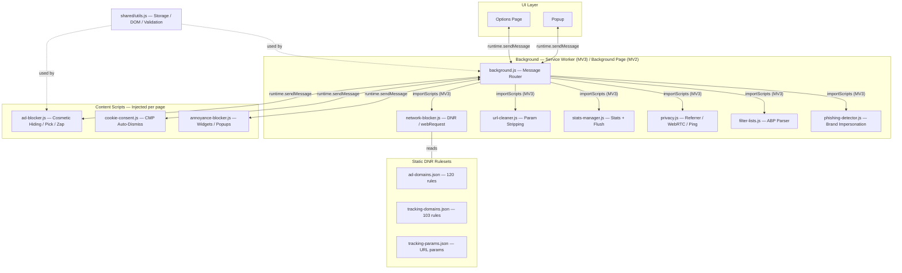

# Architecture

All background modules share a single namespace via `self.WebSuddhi = {}` and are loaded by `importScripts()` in MV3. In MV2 (Firefox), they load as separate scripts in the background page. Content scripts communicate with the background exclusively through `runtime.sendMessage`.

Safari iOS maintains standalone copies of background, content, and popup scripts under `safari-iOS/` that use the `browser.*` API directly.

## DNR Rule ID Ranges

| Range | Purpose |
|-------|---------|
| 1 — 4999 | Ad domain blocking rules |
| 5001 — 9999 | Tracking domain rules |
| 10001 — 19999 | URL parameter stripping |
| 20001 — 29999 | Dynamic rules (user-added domains) |
| 30001 — 39999 | Privacy rules (referrer, ping) |
| 40001 — 69999 | Filter list subscription rules |
